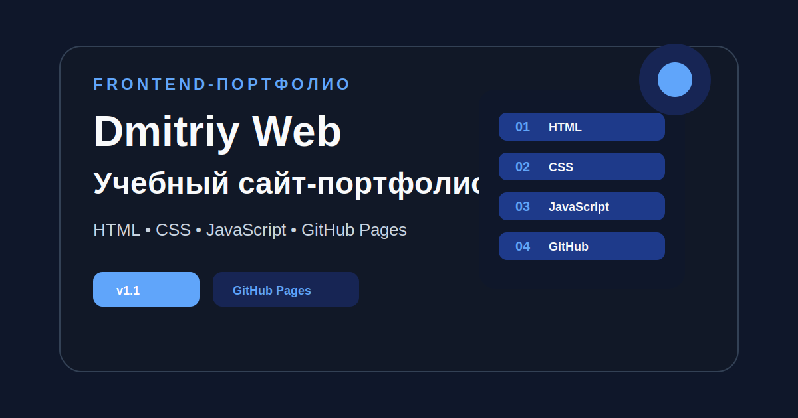

# Dmitriy Web — учебный сайт-портфолио




Это мой первый учебный сайт-портфолио, который я создаю в процессе изучения frontend-разработки.

Проект опубликован через GitHub Pages и постепенно дорабатывается как полноценное портфолио начинающего frontend-разработчика.

## Ссылка на сайт

[Открыть живую версию сайта](https://nefrit333-cpu.github.io/my-first-site/)

## Репозиторий

[Открыть код проекта на GitHub](https://github.com/nefrit333-cpu/my-first-site)

## Текущий релиз

Актуальная версия проекта:

```text
v2.5 — Улучшение блока "Навыки"
```

[Открыть релиз v2.5](https://github.com/nefrit333-cpu/my-first-site/releases/tag/v2.5)

## Стек проекта

В проекте используются:

- HTML
- CSS
- JavaScript
- Git
- GitHub
- GitHub Pages
- npm
- Prettier
- GitHub Actions
- Formspree

## Что реализовано

В текущей версии сайта уже есть:

- адаптивная верстка под desktop и mobile
- усиленный главный экран сайта
- профессиональный desktop header
- улучшенная навигация в header
- более заметная кнопка прокрутки наверх
- улучшенный блок “Обо мне”
- более профессиональный текст в блоке “Обо мне”
- карточка “Как я подхожу к разработке”
- обновлённые карточки HTML / CSS / JS / GitHub в блоке “Обо мне”
- улучшенный блок “Навыки”
- более профессиональное описание блока “Навыки”
- конкретные карточки HTML, CSS, JavaScript, Git и GitHub
- описание практического применения каждой технологии
- акцент на HTML-структуру, CSS-адаптив, JavaScript-интерактивность и GitHub workflow
- исправленные CSS-маркеры списков
- корректные символы точек и галочек в списках
- улучшенная мобильная версия сайта
- улучшенная доступность интерфейса
- улучшенная SEO-база
- улучшенное социальное превью сайта
- улучшенная контактная форма
- реальная отправка контактной формы через Formspree
- базовая защита контактной формы от спама
- скрытое honeypot-поле в форме
- проверка слишком быстрой отправки формы
- служебные поля Formspree для subject, source и page
- отправка данных формы через `fetch`
- сбор данных формы через `FormData`
- обработка успешной отправки формы
- обработка ошибки отправки формы
- сохранение введённых данных при ошибке отправки
- отдельные ошибки под полями формы
- визуальные состояния ошибок формы
- состояние отправки кнопки формы
- успешное сообщение после отправки формы
- очистка формы после успешной отправки
- обновлённое preview-изображение проекта
- видимые focus-состояния для клавиатурной навигации
- улучшенное модальное окно для работы с клавиатуры
- возврат фокуса после закрытия модального окна
- поддержка закрытия модального окна через `Escape`
- улучшенные сообщения формы через `aria-live`
- дополнительные mobile-настройки для маленьких экранов
- шапка сайта с навигацией
- мобильное бургер-меню
- переключение светлой и тёмной темы
- активное меню при прокрутке страницы
- улучшенный блок проектов
- карточки статистики в блоке проектов
- статусы проектов с индикаторами
- блоки результата для проектов
- модальные окна для проектов
- FAQ-аккордеон
- контактная форма с валидацией
- финальный блок релиза v1.0
- SEO meta-теги
- Open Graph meta-теги
- Twitter Card meta-теги
- favicon
- robots.txt
- sitemap.xml
- публикация сайта через GitHub Pages
- README.md с описанием проекта
- CHANGELOG.md с историей изменений
- CONTRIBUTING.md с правилами участия
- SECURITY.md с политикой безопасности
- LICENSE с MIT-лицензией
- .gitignore для чистоты репозитория
- .editorconfig для единого стиля редактора
- Prettier для форматирования кода
- GitHub Actions для проверки форматирования
- шаблоны GitHub Issues
- шаблон Pull Request

## Структура проекта

```text
my-first-site/
├── .editorconfig
├── .gitignore
├── .github/
│   ├── ISSUE_TEMPLATE/
│   │   ├── bug_report.md
│   │   ├── config.yml
│   │   └── feature_request.md
│   ├── workflows/
│   │   └── format-check.yml
│   └── pull_request_template.md
├── .prettierignore
├── .prettierrc
├── CHANGELOG.md
├── CONTRIBUTING.md
├── LICENSE
├── README.md
├── SECURITY.md
├── assets/
│   └── preview.svg
├── favicon.svg
├── index.html
├── package-lock.json
├── package.json
├── projects.css
├── robots.txt
├── script.js
├── sitemap.xml
└── style.css
```

## Основные разделы сайта

### Главный экран

Первый экран представляет меня как frontend-разработчика в обучении и показывает текущий фокус: HTML, CSS, JavaScript, Git и GitHub Pages.

В версии `v2.3` главный экран стал сильнее как портфолио.

Теперь первый экран лучше объясняет позиционирование, показывает стек, ведёт к проектам и контактам, а desktop header выглядит более профессионально.

### Обо мне

Раздел “Обо мне” показывает мой подход к frontend-разработке.

В версии `v2.4` блок стал профессиональнее:

- заголовок стал сильнее
- текст стал конкретнее
- лучше показан практический подход к разработке
- добавлен акцент на HTML, CSS, JavaScript, Git и GitHub
- карточка справа стала полезнее
- нижние карточки стали точнее объяснять текущие навыки
- исправлены повреждённые CSS-маркеры списков

Теперь блок выглядит не просто как учебное описание, а как часть будущего профессионального портфолио.

### Навыки

В версии `v2.5` блок “Навыки” стал конкретнее и профессиональнее.

Теперь он показывает не только список технологий, но и то, как я применяю их в интерфейсе.

В блоке есть четыре карточки:

- HTML — семантика, структура и формы
- CSS — адаптив, сетки и состояния
- JavaScript — DOM, события и логика формы
- Git и GitHub — ветки, Pull Request и деплой

Что улучшено:

- заголовок блока стал сильнее
- описание стало подробнее и профессиональнее
- карточка HTML показывает структуру, формы, ссылки и SEO-базу
- карточка CSS показывает Flexbox, Grid, адаптив, типографику и состояния
- карточка JavaScript показывает события, DOM, меню, тему, модальные окна, FAQ и форму
- карточка Git и GitHub показывает коммиты, ветки, Issues, Pull Request, релизы, GitHub Pages и Actions
- лучше видно, как навыки применяются на практике

Теперь блок “Навыки” работает как доказательство практического frontend-опыта внутри проекта.

### Проекты

Раздел проектов оформлен как витрина учебных и будущих frontend-кейсов.

В нём есть:

- вводный блок с описанием
- карточки статистики
- три карточки проектов
- статусы проектов с индикаторами
- дополнительные метки проектов
- блоки задачи и результата
- кнопки для открытия сайта и GitHub
- модальные окна “Подробнее”
- улучшенная адаптивность

Основной проект — этот сайт-портфолио. Он оформлен как первый опубликованный frontend-кейс.

### FAQ

Раздел с частыми вопросами реализован в формате раскрывающегося аккордеона.

FAQ помогает объяснить базовые вопросы про HTML, CSS, JavaScript, React и портфолио.

### Контакты

Раздел контактов содержит форму заявки.

Форма умеет:

- показывать подсказку перед заполнением
- использовать `name`-атрибуты
- использовать `autocomplete`
- использовать `required`, `minlength`, `maxlength`
- показывать ошибки под конкретными полями
- подсвечивать поля с ошибками
- очищать ошибку конкретного поля при вводе
- переводить фокус в первое поле с ошибкой
- показывать состояние отправки кнопки
- отправлять данные через Formspree
- показывать успешное сообщение
- сохранять введённые данные при ошибке отправки
- использовать `aria-describedby`
- использовать `aria-invalid`
- использовать `aria-live`

### Релиз v1.0

Финальный блок показывает, что первая версия сайта уже опубликована и оформлена как учебный релиз.

## Мобильная версия

Сайт адаптирован под мобильные устройства.

Проверялись ширины:

```text
320px
375px
414px
768px
```

На мобильной версии улучшены:

- шапка сайта
- мобильное меню
- главный экран
- кнопки
- бейджи технологий
- блок “Обо мне”
- блок навыков
- блок проектов
- FAQ
- контактная форма
- релизный блок
- модальные окна
- кнопка возврата наверх

## Доступность интерфейса

Сайт был улучшен для пользователей, которые работают с клавиатуры и вспомогательных технологий.

Что улучшено:

- добавлены видимые focus-состояния
- улучшена навигация через `Tab`
- улучшена обратная навигация через `Shift + Tab`
- добавлена подсветка карточек при фокусе внутри них
- улучшено поведение модального окна
- фокус переводится на кнопку закрытия модального окна
- фокус возвращается на кнопку “Подробнее” после закрытия модального окна
- фокус удерживается внутри открытого модального окна
- модальное окно закрывается через `Escape`
- улучшены aria-атрибуты мобильного меню
- улучшены сообщения формы через `aria-live`
- при ошибке формы фокус переходит в поле, которое нужно исправить
- добавлена поддержка `prefers-reduced-motion`

Проверка доступности выполнялась через клавиши:

```text
Tab
Shift + Tab
Enter
Escape
```

## Контактная форма

В версии `v2.0` контактная форма была улучшена как отдельная frontend-задача.

В версии `v2.1` контактная форма была подключена к реальной отправке через Formspree.

В версии `v2.2` форма получила базовую защиту от спама.

Что есть сейчас:

- выбран Formspree как способ отправки формы для статического сайта
- подключён Formspree endpoint
- добавлена отправка данных через `fetch`
- данные формы собираются через `FormData`
- добавлен заголовок `Accept: application/json`
- добавлена асинхронная функция `sendFormData`
- добавлен `async/await`
- добавлен `try/catch/finally`
- добавлена обработка успешной отправки
- добавлена обработка ошибки отправки
- форма очищается только после успешной отправки
- при ошибке отправки введённые данные не очищаются
- добавлено скрытое honeypot-поле
- добавлена проверка слишком быстрой отправки
- добавлены служебные поля Formspree

Как проверить форму:

```text
1. Открыть сайт.
2. Перейти в раздел "Контакты".
3. Заполнить имя, email и сообщение.
4. Нажать "Отправить заявку".
5. Проверить состояние кнопки "Отправляем...".
6. Проверить успешное сообщение.
7. Проверить, что форма очистилась.
8. Проверить заявку в Formspree dashboard или на почте.
```

## SEO и социальное превью

В проект добавлены базовые SEO-файлы и настройки:

- title страницы
- meta description
- meta keywords
- meta author
- canonical URL
- Open Graph
- Twitter Card
- favicon.svg
- robots.txt
- sitemap.xml
- preview-картинка проекта

Теперь ссылка на сайт лучше подготовлена для:

- поисковых систем
- мессенджеров
- социальных сетей
- внешнего представления проекта как frontend-портфолио

## Качество кода

В проект добавлены инструменты для поддержания аккуратного кода:

- .editorconfig
- Prettier
- npm scripts
- GitHub Actions

Проверить и отформатировать проект можно командами:

```bash
npm run format:check
npm run format
npm run format:check
```

После каждого push GitHub автоматически запускает проверку форматирования через GitHub Actions.

## GitHub Issues и Pull Request

В проект добавлены шаблоны для задач и изменений.

Шаблоны Issues находятся здесь:

```text
.github/ISSUE_TEMPLATE/
```

В проекте есть два основных шаблона задач:

```text
1. Сообщить об ошибке
2. Предложить улучшение
```

Шаблон Pull Request находится здесь:

```text
.github/pull_request_template.md
```

Он помогает описать:

- что изменено
- зачем это нужно
- как проверить изменения
- какие проверки качества выполнены
- связаны ли изменения с Issues
- нужны ли скриншоты

## Рабочий процесс разработки

Проект развивается через понятный рабочий процесс:

```text
Issue → feature-ветка → изменения → Pull Request → merge в main
```

Уже выполнены рабочие циклы:

```text
1. Улучшение блока проектов
2. Улучшение мобильной версии
3. Улучшение доступности интерфейса
4. Улучшение SEO и социального превью
5. Улучшение контактной формы
6. Реальная отправка контактной формы
7. Защита контактной формы от спама
8. Улучшение главного экрана и header
9. Улучшение блока "Обо мне"
10. Улучшение блока "Навыки"
```

## Документация проекта

В репозитории есть:

- `README.md` — описание проекта
- `CHANGELOG.md` — история изменений
- `CONTRIBUTING.md` — правила участия в проекте
- `SECURITY.md` — политика безопасности проекта
- `LICENSE` — лицензия проекта
- `.gitignore` — список файлов, которые Git не должен отслеживать
- `.editorconfig` — правила форматирования для редактора
- `.prettierrc` — настройки Prettier
- `.prettierignore` — исключения для Prettier
- `package.json` — npm-настройки проекта
- `.github/ISSUE_TEMPLATE` — шаблоны GitHub Issues
- `.github/pull_request_template.md` — шаблон Pull Request
- `style.css` — основные стили сайта
- `projects.css` — дополнительные стили для блока проектов, мобильной версии, focus-состояний и формы
- `script.js` — интерактивность сайта, модальные окна, FAQ, форма, accessibility-логика и отправка данных через Formspree
- `robots.txt` — правила для поисковых роботов
- `sitemap.xml` — карта сайта
- `assets/preview.svg` — визуальное превью проекта

## Чему я научился в этом проекте

Во время работы над проектом я практиковался в:

- создании структуры страницы на HTML
- стилизации интерфейса через CSS
- адаптивной верстке
- работе с Flexbox и Grid
- добавлении интерактивности через JavaScript
- обработке кликов и событий
- работе с DOM
- создании модальных окон
- создании FAQ-аккордеона
- валидации формы
- создании кнопки возврата наверх
- создании мобильного меню
- переключении темы сайта
- работе с Git
- создании коммитов
- публикации проекта на GitHub Pages
- оформлении README
- создании CHANGELOG
- создании GitHub Release
- добавлении SEO-файлов
- добавлении favicon
- добавлении robots.txt и sitemap.xml
- добавлении лицензии проекта
- оформлении репозитория как frontend-проекта
- подключении npm
- настройке Prettier
- добавлении автоматической проверки через GitHub Actions
- создании CONTRIBUTING.md
- создании SECURITY.md
- создании шаблонов GitHub Issues
- создании шаблона Pull Request
- создании отдельных feature-веток
- работе через Pull Request
- связывании Pull Request с Issues
- объединении изменений в main через merge
- подключении Formspree
- отправке данных формы через `fetch`
- сборе данных формы через `FormData`
- работе с `async/await`
- обработке успешной отправки через `try`
- обработке ошибки отправки через `catch`
- завершении состояния загрузки через `finally`
- защите формы через honeypot
- улучшении текстов и позиционирования сайта
- улучшении главного экрана
- улучшении блока “Обо мне”
- улучшении блока “Навыки”
- описании практического применения frontend-технологий
- исправлении проблем с кодировкой
- ручной безопасной замене файлов через VS Code

## Версии проекта

История изменений ведётся в файле:

[CHANGELOG.md](CHANGELOG.md)

Релизы проекта:

- [v1.0 — Первый релиз портфолио](https://github.com/nefrit333-cpu/my-first-site/releases/tag/v1.0)
- [v1.1 — Техническое оформление проекта](https://github.com/nefrit333-cpu/my-first-site/releases/tag/v1.1)
- [v1.2 — Улучшение README и визуального превью](https://github.com/nefrit333-cpu/my-first-site/releases/tag/v1.2)
- [v1.3 — Настройка качества кода и автоматических проверок](https://github.com/nefrit333-cpu/my-first-site/releases/tag/v1.3)
- [v1.4 — Документация участия и безопасности](https://github.com/nefrit333-cpu/my-first-site/releases/tag/v1.4)
- [v1.5 — Шаблоны Issues и Pull Request](https://github.com/nefrit333-cpu/my-first-site/releases/tag/v1.5)
- [v1.6 — Улучшение блока проектов через Pull Request](https://github.com/nefrit333-cpu/my-first-site/releases/tag/v1.6)
- [v1.7 — Улучшение мобильной версии сайта](https://github.com/nefrit333-cpu/my-first-site/releases/tag/v1.7)
- [v1.8 — Улучшение доступности интерфейса](https://github.com/nefrit333-cpu/my-first-site/releases/tag/v1.8)
- [v1.9 — Улучшение SEO и социального превью сайта](https://github.com/nefrit333-cpu/my-first-site/releases/tag/v1.9)
- [v2.0 — Улучшение контактной формы](https://github.com/nefrit333-cpu/my-first-site/releases/tag/v2.0)
- [v2.1 — Реальная отправка контактной формы](https://github.com/nefrit333-cpu/my-first-site/releases/tag/v2.1)
- [v2.2 — Защита контактной формы от спама](https://github.com/nefrit333-cpu/my-first-site/releases/tag/v2.2)
- [v2.3 — Улучшение главного экрана и header](https://github.com/nefrit333-cpu/my-first-site/releases/tag/v2.3)
- [v2.4 — Улучшение блока "Обо мне"](https://github.com/nefrit333-cpu/my-first-site/releases/tag/v2.4)
- [v2.5 — Улучшение блока "Навыки"](https://github.com/nefrit333-cpu/my-first-site/releases/tag/v2.5)

## Планы развития

Дальше планируется:

- усилить блок проектов
- добавить реальные проекты в портфолио
- улучшить тексты уведомлений формы
- подключить Telegram или email-уведомления
- добавить больше анимаций
- подготовиться к переходу на React
- создать новые учебные лендинги и клиентские страницы
- продолжить улучшать доступность интерфейса
- продолжить улучшать SEO и документацию проекта

## Лицензия

Проект распространяется под лицензией MIT.

Подробнее:

[LICENSE](LICENSE)

## Статус проекта

Проект находится в активной разработке.

Текущая версия: `v2.5`

## Автор

Dmitriy Web  
Frontend-разработчик в обучении
